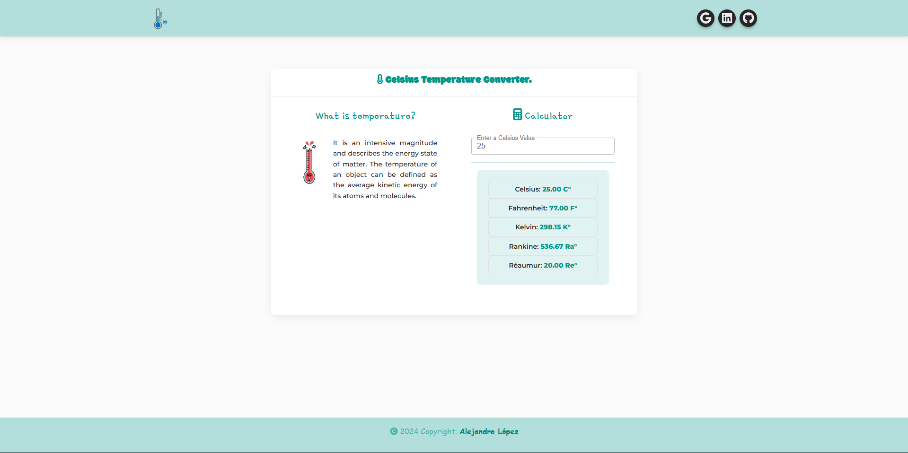

# <h1 align="center" style="color: #80cbc4;"> Celsius Temperature Converter 👨🏻‍💻 </h1> 
  

Temperature is an intensive quantity and describes the energy state of matter. All materials have atoms and molecules that are in constant motion, vibrating or rotating. The temperature of an object can be defined as the average kinetic energy of its atoms and molecules. 

` This Temperature Converter`  calculates the value entered in degrees Celsius, to give us the values ​​converted into the other temperatures.

    

  

## 
 Requirements 

- [HTML5](https://developer.mozilla.org/es/docs/Web/HTML) 
- [CSS3](https://developer.mozilla.org/es/docs/Web/CSS)
- [JavaScript](https://developer.mozilla.org/es/docs/Web/JavaScript)
- [BootStrap](https://mdbootstrap.com/)
- [Vue.js](https://vuejs.org/)
- [Temperature conversion information](https://www.beamex.com/es/descubra/conversor-de-unidades-de-temperatura/)

  

## 
 Screenshot Project 💻 

🔶 [Project Website]()

